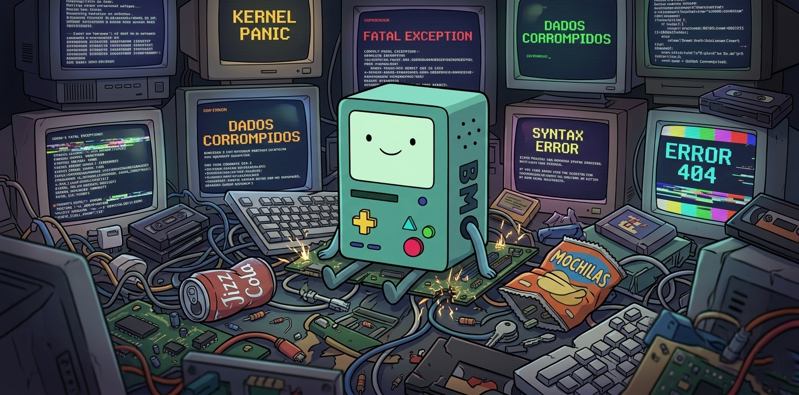

> **Spec-driven development, without the complexity.**

BMO is a lightweight framework for AI-assisted development. It takes your idea, turns it into a structured spec, and loops through every task in a fresh context window — so your agent stays sharp from the first story to the last.

---

## The Problem

Most spec-driven workflows are designed for teams that already know what a *PRD*, *epic*, or *acceptance criteria* means. Tools like BMAD-METHOD are powerful, but complex. Ralph is elegant, but bare-bones.

BMO sits exactly in between:

```
  BMAD-METHOD          BMO               Ralph
 ─────────────  ───────────────────  ──────────────
 Very Complex   Easy + extra skills  Very Simple
```

No jargon. No ceremony. Just a spec and a loop.

---

## How It Works

```
┌─────────────────────────────────────────────────────────────┐
│                        BMO Workflow                         │
│                                                             │
│   1. project-context  ──→  Describes your project,         │
│                             stack, and conventions          │
│                                                             │
│   2. prd-creator      ──→  Turns your idea into            │
│                             structured user stories         │
│                                                             │
│   3. bmo.sh (loop)    ──→  Picks the next story            │
│                    ┌──       Opens a FRESH context window   │
│                    │         Implements it                  │
│                    │         Runs quality checks            │
│                    │         Commits                        │
│                    │         Logs patterns                  │
│                    └──→  Repeat until COMPLETE              │
└─────────────────────────────────────────────────────────────┘
```

Each story runs in its **own isolated context**. The agent doesn't accumulate drift or confusion from previous sessions. This matters more than you'd think:

> Research shows that LLM responses degrade noticeably within the same context window the longer a conversation goes. Fresh context = smarter agent.
>
> *Reference: [context-rot research](https://github.com/chroma-core/context-rot)*

---

## Key Features

- **Fresh context per story** — Every task is a new conversation. No context rot.
- **project-context.md** — A shared memory file that every loop reads. Your stack, patterns, and conventions always loaded.
- **progress.txt** — A growing log of what was built and what was learned. Patterns get surfaced to future loops automatically.
- **skill-builder** — Build your own custom skills from scratch, in plain language, following BMO conventions.
- **Multi-agent support** — Works with Claude, Codex, and Amp out of the box.
- **Docker-first** — Run everything in an isolated container. Approve or discard at the end. Your local branch stays clean.
- **Per-project install** — Each project has its own `.bmo/` directory. Nothing shared, nothing leaking between projects.

---

## Built-in Skills

| Skill | What It Does |
|---|---|
| `project-context` | Creates a `project-context.md` with your stack, patterns, and conventions. Run this first. |
| `prd-creator` | Turns a feature idea into a structured PRD with prioritized user stories. |
| `prd-converter` | Converts an existing spec or description into the BMO PRD format. |
| `research` | Searches for relevant context, libraries, or implementation approaches before building. |
| `skill-builder` | Guided wizard for creating or editing custom skills. Anyone can build a skill. |

> You can edit any built-in skill or create entirely new ones using `skill-builder`.

---

## Project Structure

After installing BMO, your project looks like this:

```
my-project/
├── .bmo/
│   ├── config.yaml          # Project name, output folder, language settings
│   ├── CLAUDE.md            # Agent bootstrap for Claude
│   ├── AGENTS.md            # Agent bootstrap for Codex
│   ├── prompt.md            # Agent bootstrap for Amp
│   ├── references/
│   │   └── instructions.md  # Core loop instructions (what the agent does per story)
│   ├── scripts/
│   │   └── bmo.sh           # The main loop runner
│   ├── skills/              # All available skills
│   │   ├── prd-creator/
│   │   ├── prd-converter/
│   │   ├── project-context/
│   │   ├── research/
│   │   └── skill-builder/
│   └── _output/
│       ├── project-context.md  # Shared agent memory for this project
│       ├── prd/
│       │   ├── proposal.md          # Current active PRD
│       │   ├── progress.txt         # Loop learning log
|       |   ├── tasks.json           # PRD converted to small tasks
│       │   └── archive/             # Past PRDs and progress logs
```

Keep one `.bmo/` per project. Don't share between repos.

---

## Getting Started

### 1. Install BMO into your project

```bash
# Copy the .bmo directory into your project root
cp -r /path/to/bmo/.bmo ./my-project/.bmo
```

### 2. Configure your project

Edit `.bmo/config.yaml`:

```yaml
project_name: "my-project"
output_folder: "./_output"
communication_language: "English"
document_output_language: "English"
```

### 3. Set up project context *(recommended)*

Ask your agent to run the `project-context` skill. It will walk through your stack, conventions, and constraints — and save them to `_output/project-context.md`. Every future loop will read this file first.

> Skip this if you're building something new from scratch and don't have patterns yet.

### 4. Create a PRD

Ask your agent to run the `prd-creator` skill with your feature idea. It will ask a few clarifying questions and generate a structured PRD with user stories.

```
"I want to add user authentication with email and password."
```

### 5. Run the loop

```bash
# Run with Claude (default)
bash .bmo/scripts/bmo.sh

# Run with a specific agent
bash .bmo/scripts/bmo.sh --tool amp
bash .bmo/scripts/bmo.sh --tool codex

# Limit iterations
bash .bmo/scripts/bmo.sh --tool claude 5
```

The loop picks the highest-priority unfinished story, implements it, commits, and moves to the next. It stops when all stories are marked complete.

---

## Running in Docker *(recommended)*

Running BMO inside a Docker container gives you:

- **Safety** — The agent can't touch anything outside the container.
- **Clean rollback** — Not happy with the result? Remove the container and start over.
- **Isolation** — Your current branch is never at risk.

```bash
# Start a dev container with your project mounted
docker run -it --rm -v $(pwd):/workspace my-dev-image bash

# Inside the container, run BMO
cd /workspace
bash .bmo/scripts/bmo.sh
```

Review the output. If you like it, copy the changes out. If not, discard the container.

---

## Why Not Just Use Ralph?

[Ralph](https://github.com/snarktank/ralph) is where the loop concept comes from — and BMO forks and builds on `ralph.sh`. But Ralph doesn't know anything about your project on day one. BMO adds:

- `project-context.md` — so the agent isn't starting cold every time
- `progress.txt` — so learnings accumulate across stories
- A skill system — so you can extend and customize the workflow
- Multi-agent support — Claude, Codex, Amp, and easy to add more

Use Ralph if you want the simplest possible loop. Use BMO if you want that loop to be smarter about your project.

---

## Multi-LLM Support

BMO stores skills in the format each agent expects:

| Agent | Bootstrap File |
|---|---|
| Claude | `.bmo/CLAUDE.md` |
| Codex | `.bmo/AGENTS.md` |
| Amp | `.bmo/prompt.md` |

To support a different LLM, move the skill contents into whatever format your agent reads on startup.

---

## References

- [Ralph — the original loop](https://github.com/snarktank/ralph/blob/main/ralph.sh)
- [BMAD-METHOD](https://github.com/bmad-code-org/BMAD-METHOD)
- [context-rot research](https://github.com/chroma-core/context-rot/blob/master/images/image.png)

---

<p align="center">
  <sub>Built to keep AI agents honest, one story at a time.</sub>
</p>
